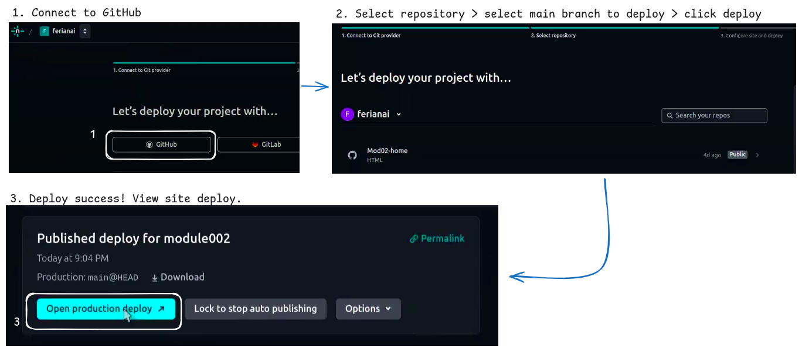
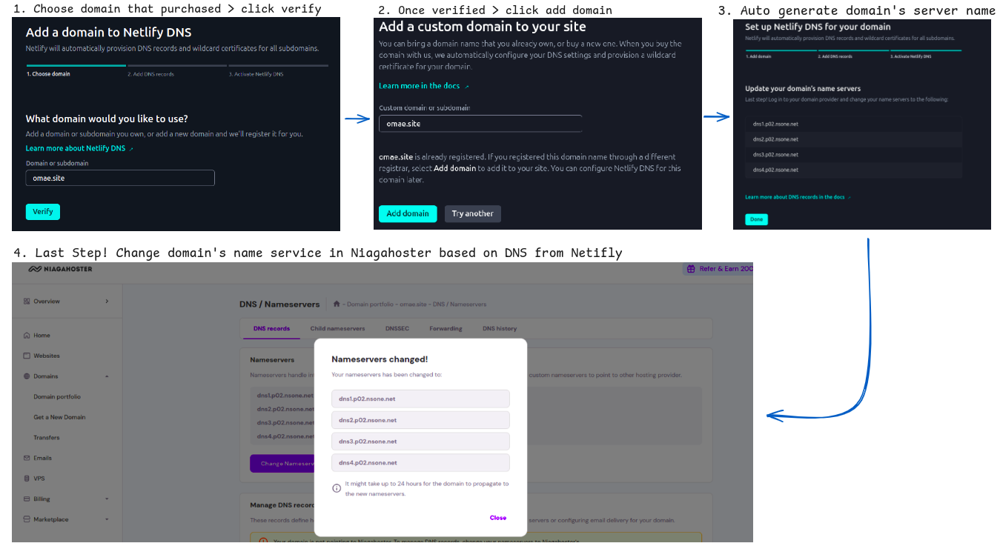

# Interior Design Portfolio Website: [https://omae.site/](https://omae.site/)

This repository documents the process of developing, deploying, and configuring an interior design portfolio website hosted at [https://omae.site/](https://omae.site/). The website showcases a collection of interior design projects, services, and design philosophy. It’s built using **HTML**, **CSS**, and **Tailwind CSS** for a modern, responsive design. The website is deployed on **Netlify** with continuous deployment from **GitHub** and is accessible via a custom domain purchased from **Niagahoster**.

---

# Table of Contents

1. [Project Overview](#project-overview)
2. [Tect Stack](#tect-stack)
3. [Setting Up the Project](#setting-up-the-project)
4. [Building the Website](#building-the-website)
5. [Deploying on Netlify](#deploying-on-netlify)
6. [Connecting a Custom Domain (Niagahoster)](#connecting-a-custom-domain-niagahoster)
7. [Screenshots](#screenshots)
8. [Conclusion](#conclusion)

---

# Project Overview

The **Interior Design Portfolio** website was created to showcase my interior design projects, services, and design philosophy. This project aims to provide potential clients with a quick, easy-to-navigate digital portfolio. The website consists of **one page** divided into **five sections**: **Home**, **About**, **Projects**, **Gallery**, and **Contact**.


## Key Features:

- **Home Section**: A welcoming and visually appealing landing page that introduces the brand and design services.
- **About Section**: A section that describes my background, design philosophy, and experience.
- **Projects Section**: Displays a brief overview of my interior design projects, with detail descriptions or case studies.
- **Galery Section**: A gallery of my interior design projects, organized by space types (e.g., living rooms, kitchens, offices) and design styles.
- **Contact Section**: A simple contact form for inquiries, consultations, and project requests.

## Design & Tools:
- **HTML**: Structure for the website’s content and sections.
- **CSS**: For styling and custom design adjustments.
- **Tailwind CSS**: A utility-first CSS framework used to rapidly build a responsive and visually appealing design without the need for custom CSS classes.
- **Responsive Design**: The website uses CSS's responsive utilities to ensure it is mobile-friendly and adapts seamlessly to different screen sizes.

The website was developed with an emphasis on clean design, ease of navigation, and showcasing high-quality images of completed projects.

---

# Tect Stack

- **HTML**: Markup language for the basic structure of the website.
- **CSS**: Custom styles applied to enhance the visual appeal.
- **Tailwind CSS**: A utility-first CSS framework used for rapid styling and responsive design.
- **Netlify**: For deploying and hosting the website with continuous integration.
- **GitHub**: For version control and managing the project’s code repository.
- **Niagahoster**: For purchasing and managing the custom domain.

---

# Setting Up the Project

### 1. Clone the Repository
Start by cloning the repository to your local machine:
```bash
    git clone https://github.com/revou-fsse-oct24/module-2-ferianai.git
    cd module-2-ferianai
```

### 2. Tailwind CSS Setup via CDN
Instead of using npm or PostCSS to compile Tailwind, we are linking to **Tailwind CSS via a CDN**. To do this, simply add the following `<script>` tag in the `<head>` section of  `index.html` (or other HTML files):

```html
<head>
  <meta charset="UTF-8" />
    <meta name="viewport" content="width=device-width, initial-scale=1.0" />
    <meta name="keywords" content="html, css, javascript" />
    <meta name="author" content="Ferianai" />
    <meta name="description" content="Ann Building" />

    <!-- tailwind core css -->
    <script src="https://cdn.tailwindcss.com"></script>
    <title>Studio Design Apa</title>
</head>
```
This CDN version of Tailwind automatically includes all of Tailwind's utilities, which makes it very simple to start using Tailwind in your HTML files without any build setup.

### 3. Run the Development Server

For local development, you can simply open the `index.html` file in your browser or use any static server. For example, if you have **VS Code**, you can use the **Live Server** extension to quickly preview your site.

This will start a local development server (usually at [http://localhost:5500](http://localhost:5500)).

> example : http://127.0.0.1:5500/

---

# Building the Website

The website is divided into **five distinct sections**, each representing a different aspect of the interior design business:

1. **Home Section**: 
   - Welcomes visitors with a clean, professional introduction.
   - Includes a brief overview and call-to-action buttons directing users to the Projects and Contact sections.

2. **About Section**: 
   - Describes the designer’s background, experience, and design philosophy.
   - Gives visitors insight into the creative process behind interior design projects.

3. **Projects Section**: 
   - Showcases a selection of featured design projects.

4. **Gallery Section**: 
   - Displays a visual gallery of completed projects with high-quality images, organized by space type or design style.

5. **Contact Section**: 
   - Provides a contact form where potential clients can reach out for inquiries, consultations, or project requests.

### Folder Structure:

```
module-2-ferianai/
├── documentation/      # Folder for images and media used in README.md
├── img/                # Folder containing image assets used in the website
├── index.html          # Main page with 5 sections
├── style.css           # Custom styles (used alongside Tailwind CSS)
└── readme.md           # to provide a visual overview of the website's layout and design.
```

### CSS and Tailwind CSS Features Used:

- **Flexbox & Grid**: For creating flexible and responsive layouts, especially in the Projects and Gallery sections.
- **Typography**: CSS/Tailwind's utility classes for styling headings, paragraphs, and text.
- **Spacing and Alignment**: Used CSS/Tailwind’s margin, padding, and text alignment utilities for consistent layout and design.
- **Responsive Design**: CSS/Tailwind's built-in responsive utilities ensure the website looks great on all devices.

---

# Deploying on Netlify

Netlify simplifies the deployment of static websites, offering automatic builds and continuous deployment from GitHub. Here's how to deploy your site:

### 1. Sign Up & Connect GitHub to Netlify

- Sign up for **Netlify** at [Netlify Sign-Up](https://app.netlify.com/signup).
- After logging in, click **'New Site from Git'** and choose **import an existing project**.
- Connect GitHub account and select the repository with the project.

### 2. Configure Deployment Settings

- Select the **branch** to deploy (typically `main`).
- For a **static website** like this, we don’t need to specify a build command.
- Set the **Publish Directory** to `/` (the root folder) since it’s a static HTML website.

### 3. Deploy the Site

- Click **Deploy Site**. Netlify will build and deploy your website.
- After the initial deployment, any future changes pushed to GitHub will trigger an automatic redeployment on Netlify.



---

# Connecting a Custom Domain (Niagahoster)

Connect a custom domain, **[https://omae.site/](https://omae.site/)**, that purchased from **Niagahoster**, to website hosted on Netlify.

### 1. Add Custom Domain in Netlify

- In the **Netlify dashboard**, go to **Domain Management** and click **Add Custom Domain**.
- Enter the custom domain (e.g., `omae.site`) and click **Verify**.
- Once verified, click **Add Domain** to finalize the setup.
- Netifly will automatically provision DNS records and wildcard certificates for all subdomains.

### 2. Configure DNS Settings in Niagahoster

- **Log in to Niagahoster account** and go to the **DNS Management** section.
- **Locate the DNS Settings**, find the section for DNS management or Nameservers. This is where we can modify the domain's DNS records.
- **Update the Nameservers**: Replace the current nameservers with Netlify’s nameservers. The nameservers you'll need to use are:
  - dns1.p01.nsone.net
  - dns2.p01.nsone.net
  - dns3.p01.nsone.net
  - dns4.p01.nsone.net
- **Save Changes** : After updating the nameservers, save the changes.

### 3. Wait for DNS Propagation

It may take anywhere from a few minutes to 48 hours for the DNS changes to propagate globally. Once done, the site will be accessible at **[https://omae.site/](https://omae.site/)**.



---

# Screenshots
Here are some screenshots of the final result:

### Desktop Template


### Tablet Template


### Mobile Template


---

# Conclusion

This **single-page portfolio** was created to display my interior design projects, services, and design philosophy in a clean, modern way. Built with **HTML**, **CSS**, and **Tailwind CSS**, the website is responsive, fast, and easy to maintain. Hosting on **Netlify** with continuous deployment from **GitHub** ensures that updates are automatically published. The custom domain **[https://omae.site/](https://omae.site/)** provides a professional, memorable web address for potential clients.

Feel free to explore the site, and reach out with any inquiries or feedback!

---

### Repository Links:
- **GitHub Repository**: [GitHub Repository URL](https://github.com/ferianai/Mod02-home)
- **Niagahoster Domain**: [Niagahoster](module002.netlify.app)

---

Let me know if you'd like any further changes!
